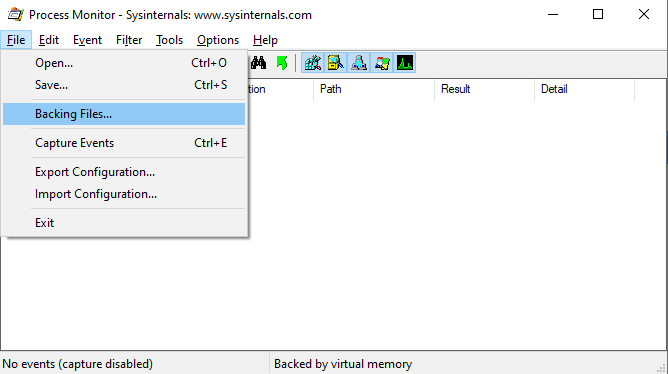
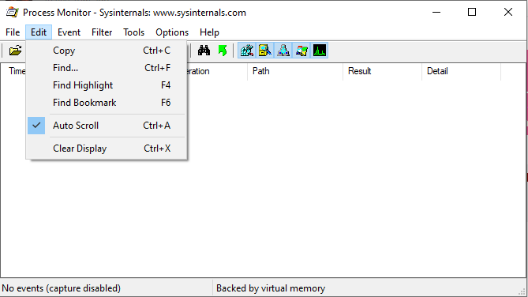
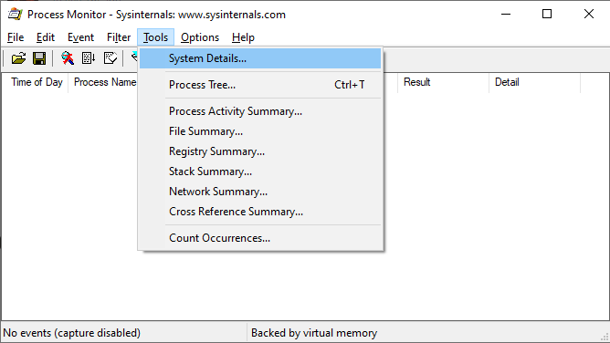
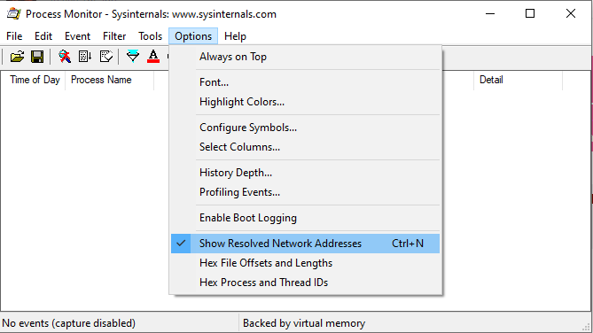

# Introduction

This will describe the basics of how to work with Process Monitor:

* How to setup Filters
  * What to consider when choosing Filters
* Highlighting, and why you'd want to
* Bookmarks and their usefulness

# Where to find everything 

# Filtering

## Prepare filters before capture

## Filter after capture

# Highlighting

# Bookmarks

