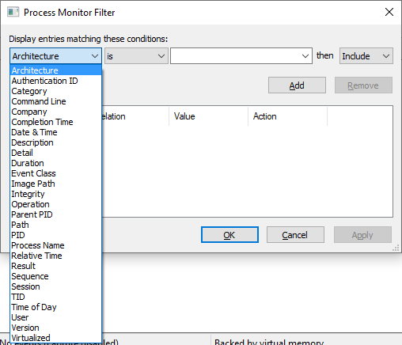

# Introduction

This will describe how to setup filters, what to think about when choosing filters.
I will also describe how to work with highlighting and bookmarks.

To reach the main menus for Filtering and Highlighting, click on the top-menu Filter.

# Filtering

## Prepare filters before capture

## Filter after capture

# Highlighting

# Bookmarks

